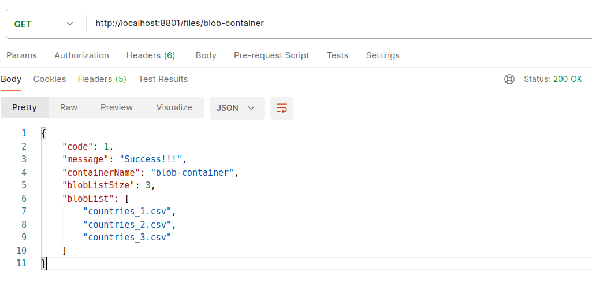

SPRING BOOT WITH AZURE STORAGE
---------------------------------------------------------------------------

**Spring Boot REST API that retrieves files from an Azure Storage account.**

---------------------------------------------------------------------------

**Gradle dependency used to work with Azure:**

```
  implementation 'com.azure.spring:spring-cloud-azure-starter-storage'
```

---------------------------------------------------------------------------

**Configuration class that generates the instance of BlobServiceClient
needed to interact with the storage container:**

```
  package com.example.demo.configuration;

  import com.azure.storage.blob.BlobServiceClient;
  import com.azure.storage.blob.BlobServiceClientBuilder;
  import org.springframework.beans.factory.annotation.Value;
  import org.springframework.context.annotation.Bean;
  import org.springframework.context.annotation.Configuration;

  @Configuration
  public class BlobStorageConfiguration {

    @Value("${connectionString}")
    private String connectionString;

    @Bean
    public BlobServiceClient getBlobServiceClient() {
        return new BlobServiceClientBuilder().connectionString(connectionString).buildClient();
    }

  }

```

**The connection string used in the previous class is retrieved from an environment variable
(application.properties):**

```
  connectionString=${STORAGE_CONNECTION_STRING}
```

---------------------------------------------------------------------------

**A few files were uploaded to an Azure Blob Container named "blob-container":**


**A list of those files is read in this endpoint:**



---------------------------------------------------------------------------

**Code snippet that shows how to retrieve the list of elements inside the blob container:**

```
  List<String> filesList = new ArrayList<>();
    
  BlobContainerClient blobContainerClient = blobServiceClient.getBlobContainerClient(containerName);
  for (BlobItem blobItem: blobContainerClient.listBlobs()) {
      filesList.add(blobItem.getName());
  }

```

---------------------------------------------------------------------------

**Content of file "countries_1.csv" is retrieved as Base64 from container "blob-container":**


---------------------------------------------------------------------------

**Code snippet that shows how to retrieve the list of elements inside the blob container:**

```
  BlobContainerClient blobContainerClient = blobServiceClient.getBlobContainerClient(containerName);
  BlobClient blobClient = blobContainerClient.getBlobClient(filePathAndName);
  if (blobClient.exists()) {
      byte[] fileContent = blobClient.downloadContent().toBytes();
      String fileContentAsBase64 = Base64.getEncoder().encodeToString(fileContent);
  }

```

---------------------------------------------------------------------------